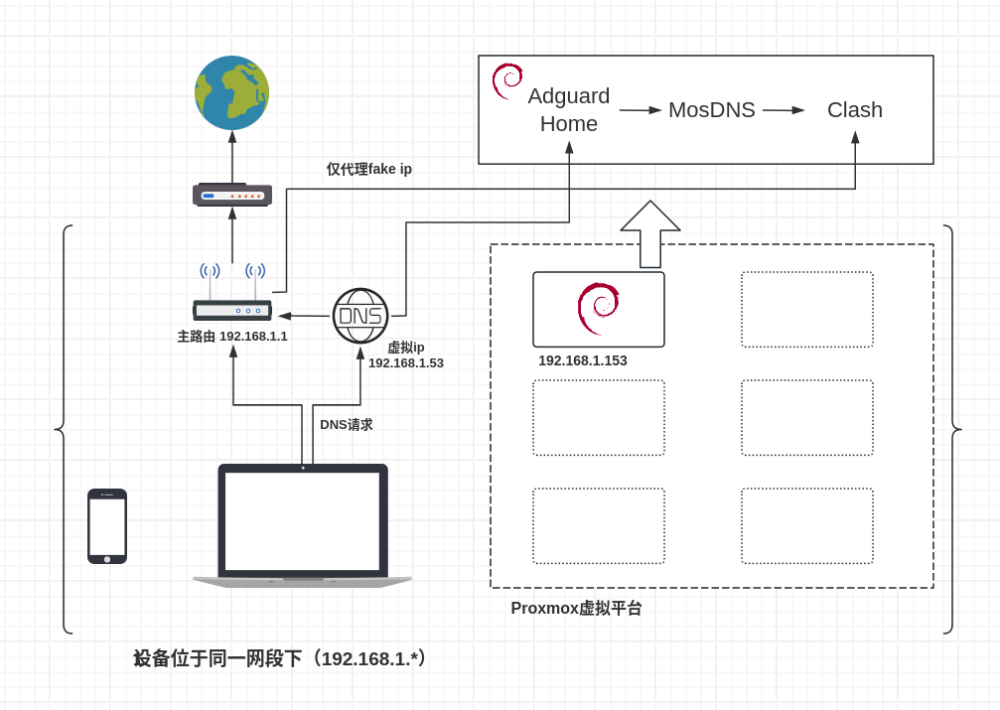
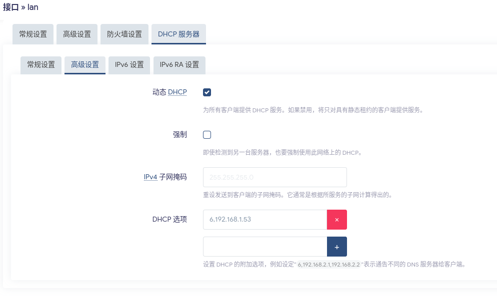
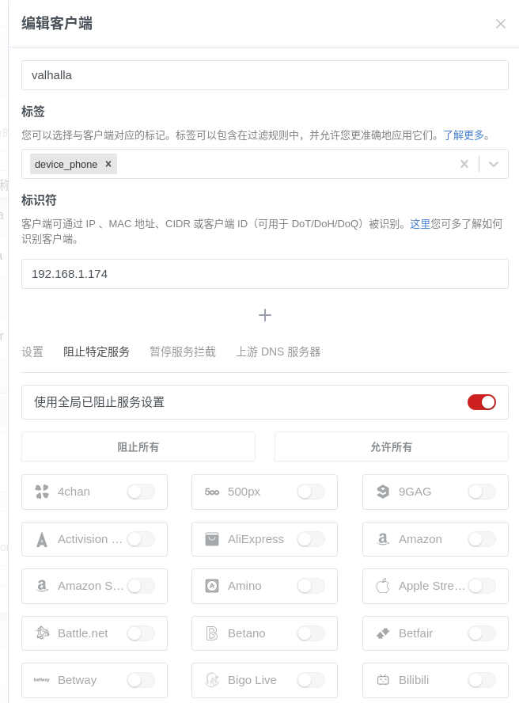

> Homelabbing is just a kind of roleplaying, roleplaying as sysadmins.

## 前言
去年给家里的 Redmi AX6S 刷了 OpenWrt，相比原厂系统灵活了很多，并且装上了 OpenClash，用默认配置就能给连上网络的所有设备提供透明的魔法上网体验，稳定使用一年多，因此在此期间搞了一堆二手零件，凑了一台电脑装上 Proxmox 虚拟机平台作为 Homelab。

最近又想着在在路由器上装一些别的插件，这样一来仅仅 256MB 的内存就不太够用了，遂着手研究所谓的"旁路由"（？）方案，一开始是在 Proxmox 上创建了一个虚拟机安装 OpenWrt（实际上是 ImmortalWrt），在主路由给客户端设置网关和 DNS 为旁路由 ip（最简单的方案），然后参考 [这位博主](https://songchenwen.com/tproxy-split-by-dns) 的方案，装上了 Adguard Home 等服务，并作了 fake ip 段 `198.18.0.0/16` 的分离和策略路由（这位博主没有使用旁路由，这个思路实际上来自他的评论区）

然而这样一折腾，想要而效果似乎是基本上达到了，但 OpenClash 默认配置的 nftables 较复杂，不便于自定义，有时出了点问题都不知道怎么排查错误，OpenWrt 作为精简系统也有诸多残缺的地方，所以我参考 [这位博主](https://evine.win/p/%E6%88%91%E7%9A%84%E5%AE%B6%E5%BA%AD%E7%BD%91%E7%BB%9C%E8%AE%BE%E8%AE%A1%E6%80%9D%E8%B7%AF%E5%BC%80%E5%90%AFdebian%E7%9A%84%E6%97%81%E8%B7%AF%E7%94%B1%E4%B9%8B%E8%B7%AF%E4%B8%80)（实际上这个系列的底子都是来自他的方案）并结合前人可能的优势和我实际情况，形成了本文中讨论的这一方案。

## （可能是）最终方案

### 各模块简介
**主路由**：ImmortalWrt 24.10 `192.168.1.1`

（是否使用 Immortal 实际上并不重要，我纯粹是为了方便，版本只要是用 `Firewalld4`和`nftables`的就行，本文默认使用`nft` 命令）在 dhcp 选项中设置`6,192.168.1.53`,给 dhcp 客户端下发 DNS 为`192.168.1.53`，主路由还有一项重要任务就是将 Clash 产生的 Fake IP 的网段的流量转发给代理机

:::caution
在全部搭建好之前，你当然**不应该**这样设置
:::

**DNS 虚拟 ip** `192.168.1.53` ==> `192.168.1.1` 或 `192.168.1.153`

这是由于我的现实情况可能出现 homelab 下线，如果使用 dhcp 选项直接下发 `192.168.1.153`为唯一 DNS，那么当 homelab 下线时，dhcp 客户端仍然向已经不存在的`.153` 发出 DNS 请求，就会导致网络瘫痪，实际上 dhcp 选项可以下发多个 DNS 服务器，但在切换时客户端可能有一定的延迟（我没有自己测试过），我希望尽量无缝切换的体验

**DNS+ 代理机** Debian 13 `192.168.1.153`

安装 Adguard Home 提供广告过滤，MosDNS 国内外分流，Clash 负责国外 DNS 产生 Fake IP，国内 DNS 传回主路由进行处理，Fake IP 流量在经过主路由时被转发到该机器的 Clash 进行代理，其他流量不受影响

## 参考方案对比
### DNS 服务的序列
实际上，我最初尝试这三个服务的结合时，第一个成功的方案是把 OpenClash 前置，例如参考 [这个网页](https://github.com/Kirbytronic/openclash-mosdns-adguardhome) 上面的方案，他的方案成功后，在 Adguard Home 的管理界面里只能看到一个客户端 `127.0.0.1`，这就使得 AdgHome 的功能残缺了，所以我后面都探索 AdgHome 前置的方案。

### 单一路由的方案
当前的 DNS 顺序，我最初参考了 [这位博主](https://songchenwen.com/tproxy-split-by-dns) 和 [这位博主](https://blog.openwrtcn.eu.org/dnsling-wu-ran/) 的文章，两者方案类似，都没有采用旁路由，后者使用 `iptables`，对于现在的 OpenWrt 版本来说已经有些过时了，这一方案对我来说难以实现，我的主路由性能不足以承载这些服务，所以我照搬了这一方案，并把网关和 DNS 都设置到 proxmox 上的那台 ImmortalWrt，基本功能确实实现了，但我所希望的"只有国外流量经过 clash 内核"不知怎么还是没有实现，于是开始寻求国内流量直接不经过旁路由的方法，前一位博主的网站有评论区，我在评论区中学习到了该方案在旁路由下多种可能的配置方式。(这也让我对**路由表**和**路由规则**开始有了一些了解

### 不同的旁路由代理方案
|   | Fake IP    | 真实 IP   |
| --------  | -------- | ------ |
| 只下发 DNS | 主路由通过路由规则仅转发 fake ip 段到 clash | 需要在主路由上作分流，压力大 |
| 下发 DNS 和网关 | 在旁路由上通过 nft 转发 fake ip 段，但所有流量都经过了旁路由 | 在旁路由上作分流，所有流量都经过 |

按我理解，只下发 DNS，可以做到几乎不影响正常国内上网，但 Fake IP 模式下主路由上的分流相较于真实 IP 是更加简单的，而下发 DNS 和网关时这两种模式的差异实际上和单一路由下的情况差不多（？）

## 总结
### "Fake IP 网关"方案（？）
旁路由的概念一直很模糊，我自己也一知半解，个人理解为客户端使用主路由之外的一台机器作为网关（无论是通过手动设置还是 dhcp 选项自动下发），大多数时候也同时提供 DNS 服务，这是目前网上最常见的方案，但这种方案的问题是
- 所有流量，无论是否需要代理，都经过"旁路由"，也许当中的开销不大，但我认为这是不必要的，我希望能够避免
- 另外，所有流量经过 mosdns 的域名分流后，最终还要再进行一次分流（通过 clash 核心或 nftables），这可能是不必要的。

所以我选择让那台 Debian 机器只负责 DNS 和国外流量的代理，其他流量正常走主路由，就像没有旁路由一样（）（理论上是这样），实现方法就是在主路由的 dhcp 选项中只下发 DNS，网关仍使用主路由，通过在主路由上设置路由规则把需要代理的流量转发到 clash。（在各大网络论坛中提到这种方案的人有很多，但似乎详细写这个的博主少（？））

如果要采用这个方案，我们就需要采用 clash 的 fake ip 模式，它在这里的意义在于把所有国外 ip 映射到一个网段 `198.18.0.0/16` 下，方便在主路由上设置路由规则进行转发，否则的话，clash 解析出来真实 ip，在经过主路由时还要进行分流，不仅多余而且对于主路由性能不佳的情况，容易造成负担，不如直接把网关也设置到旁路由，在性能更强的旁路由上作分流，本系列大量参考的 [这位博主](https://evine.win/p/%E6%88%91%E7%9A%84%E5%AE%B6%E5%BA%AD%E7%BD%91%E7%BB%9C%E8%AE%BE%E8%AE%A1%E6%80%9D%E8%B7%AF%E5%BC%80%E5%90%AFdebian%E7%9A%84%E6%97%81%E8%B7%AF%E7%94%B1%E4%B9%8B%E8%B7%AF%E4%B8%80) 就是用的真实 IP 的不分离方案。

### 服务顺序的优势
`Adguard Home => MosDNS => Clash`的顺序，Adguard Home 的功能是最丰富的，也是配置较为不灵活的，按我个人理解 Adguard Home 必须在最前，才能保留其所有功能（例如如果把 Adguard Home 放在其他服务后面，无法正确识别客户端，而我希望用到 Adguard Home 的客户端管理功能），MosDNS 放中间，它有灵活的转发和切换功能，即使后面的 Clash 炸了，也可以设置 fallback 防止影响基本上网功能（我自己暂时还没有这样做，我可能宁愿直接把旁路由关了（））

### DNS 高可用
前面已经说过，这是由于我的实际情况，`.153`很可能不会一直在线，所以选择了采用单个虚拟 ip 的模式，用 `keepalived` 实现，后续会补充相应脚本，用于在主备节点切换时修改 nftables 和路由规则。

### 关于 ipv6
呃呃不太懂，暂时不弄（）

## 后续
后续我将逐一记录下我按照该方案安装和配置系统，安装相关服务，配置自动脚本等具体过程以及我在其中踩到的一些（很多...）坑
