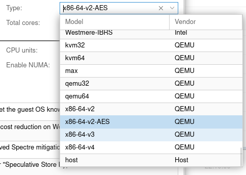
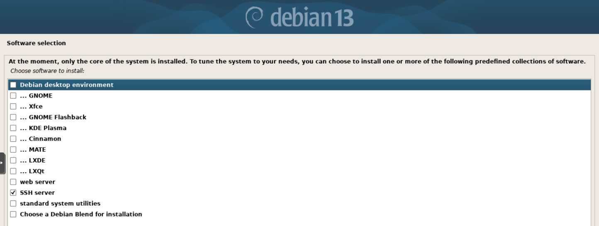
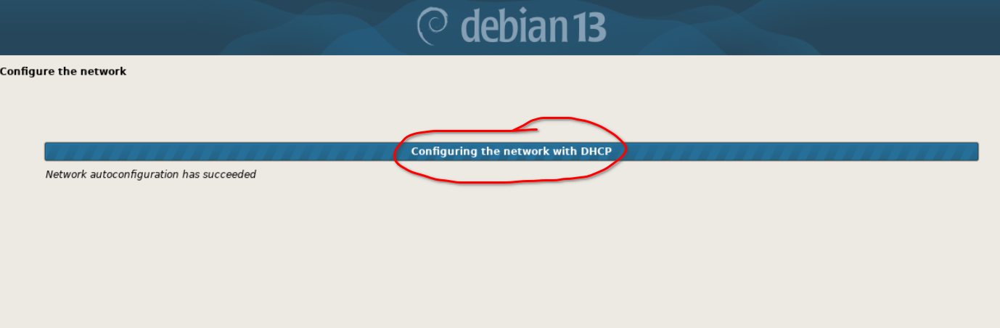
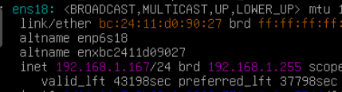
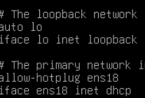

前文中提到的方案[需要的环境](/posts/homelab-network-0/#各模块简介)是一台安装了OpenWRT/ImmortalWRT的路由器和一台作为DNS和代理机的机器，OpenWRT的安装过程这里不再赘述，按对应机型查看官方文档即可，配置过程在搭建好完整的DNS和代理环境之后再开始介绍。

前置条件：
  - 最好需要有现成的科学上网环境，例如在OpenWRT上运行一个临时的OpenClash之类的软件，方便在虚拟机上下载我们后续所需的文件。

我选择在一台已有的Proxmox平台上创建一个Debian 13虚拟机作为DNS和代理机。
## 创建虚拟机
创建个普通的虚拟机就行，整体上没什么不同，但是有一点（不知道是否重要）需要注意，在设置cpu的那个界面，我这里proxmox默认选择的是`x86-64-v2-AES`,但一会儿下载的clash内核需要`x86-64-v3`（也可以选择下载支持v2的版本），虽然**我不懂选择这个有没有什么明显的优化，但是似乎也没有造成明显的负面影响**，所以我在这里手动选择了`x86-64-v3`

其他的页面一路确认过去就行
## 安装最小化的系统
Debian的安装过程不再赘述，怎么装都行，在观察了其他博主的文章后，经我测试在`软件选择`界面只选择`SSH server`那一项是可行的，这样就会的到一个最小化的系统。


Debian第一次安装时可能还存在[这个问题](https://forums.debiancn.org/t/topic/6044)，修改镜像源后仍然很慢，原因是安全相关的更新仍然走官方源，该话题下提到的可能的解决方案是断网安装。
> 实际上我当时真的等了一小时多：（

:::note
如果你已有好的代理环境，请忽略这条，我是因为当时代理出问题才很慢的
:::
## 配置
:::tip
以下需要在`root`环境下进行
:::
### 配置一个静态ip
编辑`/etc/network/interfaces`，目前应该只有`nano`编辑器，所以输入`nano /etc/network/interfaces`，并输入以下内容，nano的用法和普通编辑器类似，直接粘贴进去就好，退出时使用`Ctrl+X`
```bash
# 这部分自带的不用管
# This file describes the network interfaces available on your system
# and how to activate them. For more information, see interfaces(5).

source /etc/network/interfaces.d/*

# The loopback network interface
auto lo
iface lo inet loopback

# 下面这里开始是需要改动的内容
# The primary network interface
allow-hotplug ens18 #网卡名称，使用ip addr查看
iface ens18 inet static # 设置为静态ip
        # 我选择了这个较为有意义的ip，.53我打算作为主路由和这台机器共用的虚拟ip
        address 192.168.1.153/24
        gateway 192.168.1.1 # 网关地址，设置为你的主路由
        network 192.168.1.0
        broadcast 192.168.1.255
        # !这是在本机配置好DNS服务之后才这样设置的，现在请暂时设置为你的主路由或代理机!
        dns-nameservers 127.0.0.1

```
然后输入以下命令重启网络服务
```bash
systemctl restart networking.service
```
:::caution
`dns-nameservers`在本方案完全配置好之后默认使用本机的DNS服务，但现在请不要这样设置，另外这里【可能】有一个坑，下面讲
:::
### 可能的坑
在我第一次配置好后，我想把DNS改成`127.0.0.1`，却发现没有成功，运行`dig <域名>`等命令发现其中的`SERVER:`字段仍然显示我原先的旁路由ip（因为我一开始设置了一台已有的OpenWRT旁路由用于科学下载资源），运行`dig @127.0.0.1 <域名>`，指定DNS服务器为本机后，发现成功返回fake ip，且`SERVER:`字段为本机，Adguard Home面板上也有记录，说明DNS服务没有问题。

再尝试临时修改`/etc/network/interfaces`为主路由ip，发现仍然没有变化，才意识到现在使用的dns可能是由DHCP下发的（但这台机器根本没有在使用dhcp啊！）

在排查过程中，我发现Debian系统的DNS设置除了在`/etc/network/interfaces`,还有`/etc/resolv.conf`，查看该文件的manpage发现其中提到
> The resolver is a set of routines in the C library that provide access to the Internet Domain Name System (DNS). The resolver configuration file contains information that is read by the resolver routines the first time they are invoked by a process. The file is designed to be human readable and contains a list of keywords with values that provide various types of resolver information. The configuration file is considered a trusted source of DNS information; see the trust-ad option below for details.

> If this file does not exist, only the name server on the local machine will be queried, and the search list contains the local domain name determined from the hostname.`

看来该文件的优先级较高，问题应该出在它身上了，`cat /etc/resolv.conf`查看它的内容，发现有以下关键的两行
```bash
# Generated by dhcpcd ...
nameserver 192.168.1.100 # 原先的旁路由ip，设置在主路由的dhcp选项中
```
看来确实是dhcp覆盖了该文件中的dns设置，但经过我排查，发现本机没有在运行dhcpcd,目前的ip也确实是由`/etc/network/interfaces`设置的静态ip，经过我对安装过程的回忆，我猜想是在安装过程中使用dhcp获取了ip地址以及dhcp选项中的dns服务器，现在不使用dhcp了，但是dns设置保留在了`/etc/resolv.conf`中。

既然dhcpcd已经不再运行，该文件就没有再次被覆盖的风险，所以我的解决的方案是删除自动生成的文件，再手动创建
```bash
rm /etc/resolv.conf
echo "nameserver 127.0.0.1" | tee /etc/resolv.conf # 在配置好本机的DNS服务后再执行
```

**事故现场情景再现：**

事后我进行复盘，用相同方法安装了一台Debian虚拟机，在安装好后立刻执行`ip addr`和`cat /etc/network/interfaces`，看到以下内容，证实了是安装过程中临时使用dhcp造成的


### 配置网关功能
设置必要的内核参数，让这台机器具有网关的功能
```bash
# 参考: https://evine.win

# 开启流量转发
echo "net.ipv4.ip_forward = 1" >> /etc/sysctl.d/90-override.conf

# 流量转发设备建议设置 default_qdisc 为 fq_codel，详细信息可以阅读：https://www.starduster.me/2020/03/02/linux-network-tuning-kernel-parameter/#netcoredefault_qdisc
echo "net.core.default_qdisc = fq_codel" >> /etc/sysctl.d/90-override.conf

# 用于控制反向路径过滤（Reverse Path Filtering）的一个内核参数，它决定了系统如何处理进入的数据包的源地址校验。
# 如果命令 sysctl -a | grep '\.rp_filter' 输出中你的网卡对应的值是 2 ，则需要重新覆盖设置为 0。
# 0：表示不开启源地址校验。系统不会检查进入的数据包的源地址，即使数据包的源地址不可达，也不会被系统丢弃。
# 1：表示开启严格的反向路径校验。系统会检查每个进入的数据包，确保其反向路径是最佳路径。如果不是，数据包将被丢弃。
# 2：表示开启松散的反向路径校验。系统会检查进入的数据包的源地址是否可达，即反向路径是否能通（通过任意网络接口）。如果反向路径不通，数据包将被丢弃。
echo "net.ipv4.conf.default.rp_filter = 0" >> /etc/sysctl.d/90-override.conf
echo "net.ipv4.conf.*.rp_filter = 0" >> /etc/sysctl.d/90-override.conf

# 使设置生效
sysctl --system
```
## 安装必要软件
目前需要的软件有
- 系统工具：`sudo`,`bind9-dnsutils`
- 下载工具：`curl`,`wget`,`git`
- 解压工具：`bzip2`,`xz-utils`,`unzip`

先`apt update`更新一下，然后安装以上软件
```bash
apt install -y --no-install-recommends \
  sudo \
  bind9-dnsutils \
  curl \
  wget \
  git \
  bzip2 \
  xz-utils \
  unzip
```
## 总结
目前已经装好了Debian系统，配置了网络，设置了内核参数，安装好必要软件，后面将会开始建立DNS服务
