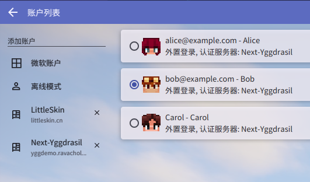
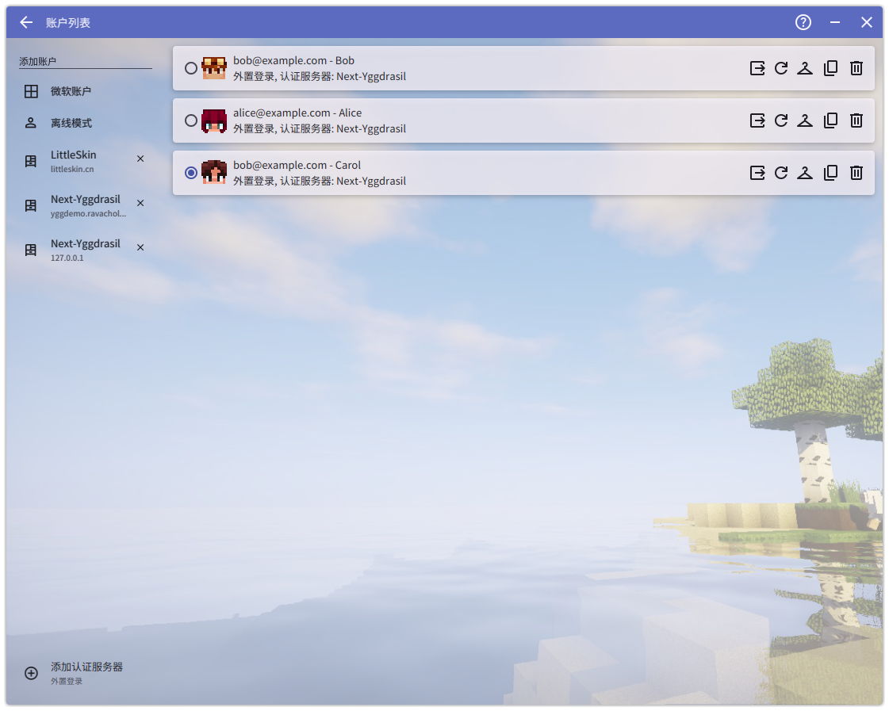
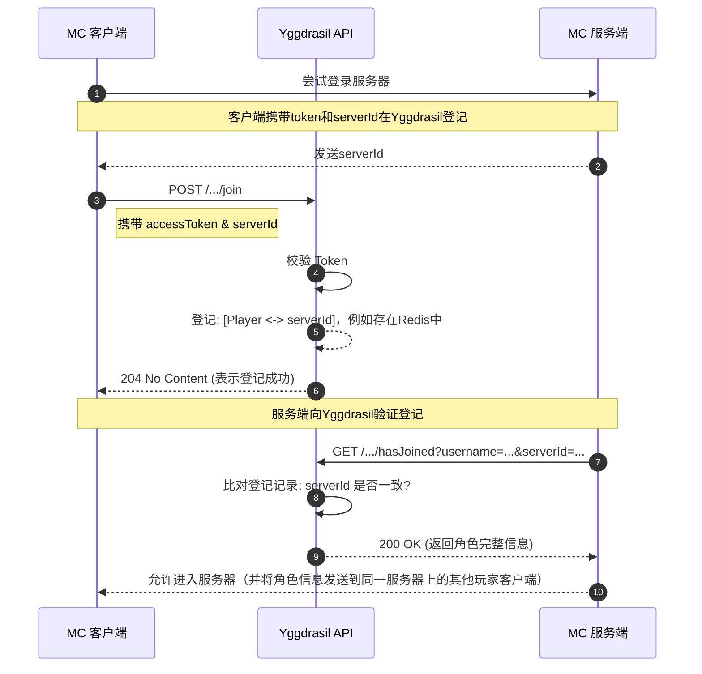
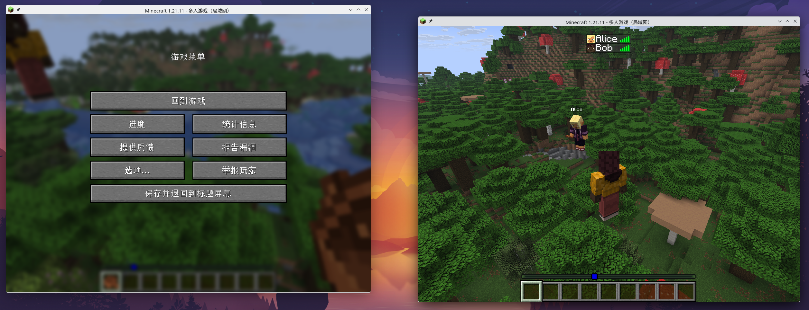
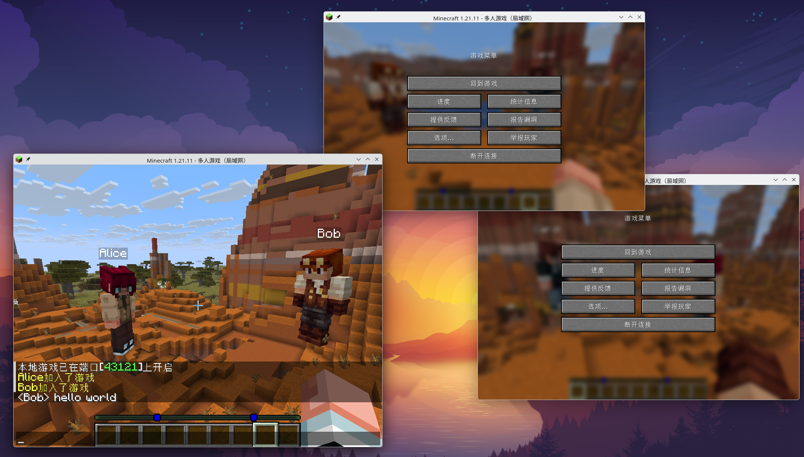
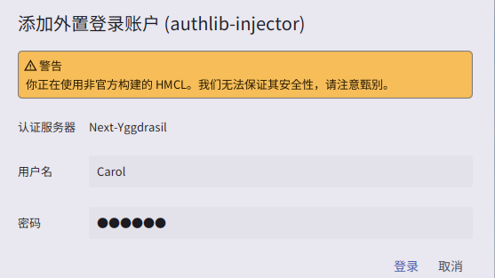
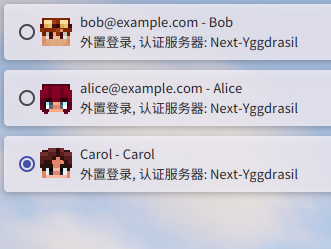

最近在家里的homelab上面开了个虚拟机专门用来运行Minecraft服务器
...TODO
## MC外置登录与Yggdrasil协议
...TODO
## 现有方案
...TODO
## NextJS与Vercel部署
所以我使用到的服务如下：
- Vercel：用来以Serverless的方式托管NextJS项目
- Upstash：适用于Serverless环境的Key-Value数据库，提供了基于http的类似Redis的接口和SDK

项目的目录大致如下
```
next-yggdrasil/
  public/textures/*.png # 示例材质
  src/
    app/ # 以资源路径定义路由
      authserver/
        authenticate/route.js # /authserver/authenticate接口
        ...
      sessionserver/
        ...
    lib/
      database.ts # Demo使用的模拟数据，全部写死
      types.ts # 模型定义
  tests/http/ # Webstorm提供的HTTP Client测试
    authserver.http
    sessionserver.http
  .env.local # 本地开发环境
  package.json
  docker-compose.yaml
  ...
```
## 实体模型定义
根据`authlib-injector`项目提供的yggdrasil协议服务端规范，我们的项目中需要定义以下实体:
- 用户：对应玩家账号，可以拥有多个角色(Profile)，用邮箱来区分，登录时使用邮箱和密码
- 角色：玩家在游戏中的身份，与账号是多对一的关系，这里使用`owner`来关联账号的`id`
- \*材质&皮肤：材质包括**皮肤**和**披风**，我们只实现皮肤，这两个type不存在我们的模拟数据库中，只在返回数据时进行封装，材质和角色通过角色的`SkinId`字段来关联，多个角色可以使用同一个材质

```typescript
export interface User {
    id: string;
    email: string;
    password: string;
    properties?: {
        name: string;
        value: string;
    }
}

export interface Profile {
    id: string;
    name: string;
    owner: string;
    skinId?: number;
    uploadableTextures?: "skin" | "cape" | "skin,cape"
    properties?: {
            name: string;
            value: string;
            signature?: string;
        } []
}

export interface Skin {
    id?: number;
    url: string;
    metadata: {
        model: "default" | "slim"
    }
}

export interface Texture {
    timestamp: number;
    profileId: string;
    profileName: string;
    textures: {
        SKIN?: Skin
    }
}
```
## 实现过程
简单记录下开发这个Demo的过程，我对其中一些接口的实现示例，以及其中踩到的一些坑，yggdrasil曾经是mojang官方使用的api，随着mojang的发展有很多历史包袱，设计上有一些反直觉的细节，我在实现过程中遇到了就记录下来

开发环境:
- Webstorm 免费版
- nodejs 25
- redis
- \*HMCL 用于测试

其中我在生产环境使用Upstash，而本地开发环境使用redis，并且我想提供self-host的选项，所以需要一个考虑提供一个kv缓存的抽象层，但由于这两个SDK提供的接口很相似，大部分常用的方法是可以重载的，所以在这个Demo里面就偷懒直接判断环境来选用其中一个SDK了....

```typescript
import { Redis } from '@upstash/redis'
import { Redis as IOREdis } from 'ioredis'

const isLocal = process.env.NODE_ENV === 'development';

export const redis = isLocal?
    new IOREdis(process.env.REDIS_URL || 'redis://localhost:6379')
    : Redis.fromEnv()
```

我是每个模块开发完，先用Webstorm自带的HTTP Client测试一波，再到HMCL里面做真实环境的测试，HTTP Client的测试倒是问题不大，HMCL的真实环境在测试各个功能时对于各个接口模块的依赖顺序可能有所不同，我自己踩坑之后总结出的开发顺序可以是：

`API元数据 -> 用户部分 + 获取单个Profile的接口 -> 会话部分 -> 材质和皮肤等`

### API元数据
先实现元数据的接口是因为
> 以下 API 是为了方便 authlib-injector 进行自动配置而设计的。
> -- yggdrasil服务端规范

在很多启动器里填入兼容authlib-injector的外置登录接口地址后，启动器会先调用 `GET /` 获取元数据，里面主要是服务器基本信息和扩展功能之类的



:::note
我是在读完了规范之后决定先实现这个接口的，所以没有测试过未实现该接口时启动器的行为，我猜测也能正常运行
:::

`GET /`的响应大致如下，参考[yggdrasil服务端规范-元数据获取](https://github.com/yushijinhun/authlib-injector/wiki/Yggdrasil-%E6%9C%8D%E5%8A%A1%E7%AB%AF%E6%8A%80%E6%9C%AF%E8%A7%84%E8%8C%83#api-%E5%85%83%E6%95%B0%E6%8D%AE%E8%8E%B7%E5%8F%96)

```json
{
  "meta": {
    "serverName": "Next-Yggdrasil",
    "implementationName": "next-yggdrasil",
    "implementationVersion": "1.0.0",
    "feature.non_email_login": true
  },
  "skinDomains": [
    "example.com",
    ...
  ],
  "signaturePublickey": "-----BEGIN PUBLIC KEY-----
  ...
  -----END PUBLIC KEY-----"
}
```

这个Demo项目没有很复杂的功能，也没有注册和登录界面，所以我采用的示例实现就是如下的直接返回一个json对象，后续实现可真正用于生产环境的服务时我考虑加入管理员可配置的条目

```typescript
export async function GET() {
    const publicKey = rsaPubKey;
    const skinDomain = process.env.SKIN_DOMAIN?.replace(/\\n/g, '\n');

    return NextResponse.json({
        meta: {
            serverName: "Next-Yggdrasil",
            implementationName: "next-yggdrasil",
            implementationVersion: "1.0.0",
            "feature.non_email_login": true
        },
        skinDomains: [skinDomain],
        signaturePublickey: publicKey
    });
}
```
### 实现用户相关接口
我决定先实现在启动器的账户选择界面能正常登录、选择角色、获取信息，再考虑实现加入服务器。

用户登录部分涉及到的接口主要是由启动器调用的，像HMCL之类支持外置登录的启动器，会让用户输入邮箱和密码，启动器不需要记录用户的邮箱和密码，而是将这些登录凭据发送到yggdrasil的登录接口，这时yggdrasil服务会签发一个token并返回用户信息，启动器拿到token之后在有效期限内可以访问其他需要登录的接口，如选择角色，加入游戏等，这些接口的路径大多在`/authserver`下，参考[yggdrasil服务端规范-用户部分](https://github.com/yushijinhun/authlib-injector/wiki/Yggdrasil-%E6%9C%8D%E5%8A%A1%E7%AB%AF%E6%8A%80%E6%9C%AF%E8%A7%84%E8%8C%83#%E7%94%A8%E6%88%B7%E9%83%A8%E5%88%86)

:::caution
按照该规范的建议，一部分涉及认证的接口应当受到速率限制，而这个项目仅仅是一个Demo，所以我**完全没有做速率限制**，等我下次想要开发一个真正能稳定使用的外置登录服务时再考虑这些
:::

#### 登录
`POST /authserver/authenticate`

这里启动器会发送一个POST请求，携带一个有`username`和`password`字段的对象，可能还带有`clientToken`，服务器验证后签发一个accessToken，并把这两个token返回给启动器，并包含用户绑定的所有角色（`availableProfiles`），如果用户只有一个角色，这里就直接选择了（`selectedProfiles`）

```typescript
const userWithProfiles = DB.auth(username, password);

if (!userWithProfiles) {
  return NextResponse.json(new 
  ForbiddenOperationException("Invalid credentials..."), {
    status: 403
  });
}

//...token构建等过程

const accessToken = uuid4().replace(/-/g, '');

const EXPIRATION = 1296000;
await redis.set(`token: $ {accessToken}`, JSON.stringify(token));
await redis.expire(`token: $ {accessToken}`, EXPIRATION) 
// 这里为了后续的signout等接口，
// 把为某个用户签发的token全都关联到一个以该用户id为key的set下面
await redis.sadd(`user_tokens: $ {userWithProfiles.user.id}`, accessToken);

return NextResponse.json({
  accessToken,
  clientToken: finalClientToken,
  availableProfiles,
  selectedProfile,
  user: requestUser ? {...userWithProfiles.user,
    password: undefined
  }: undefined,
});
```
这里一开始只在redis里面存放了以`accessToken`的内容为key，以及用户所选择的Profile, token签发时间等的json对象为value的键值对

按照规范，token是绑定到角色的，所以在token里面一定要记录用户选择的角色，如果一个用户在登录时有多个角色，启动器（例如HMCL）可能会立即调用`/refresh`来选择单独的角色，PCL2似乎是在用户启动游戏前选择角色（我记不清了，没做测试）

后面一个`redis.sadd(...)`是我后面实现`/signout`时加上去的，按照规范要求实现能记录并失效同一用户的所有token，所以我在签发token时就把这些token挂在一个以用户id为key的set下面
> （然而我发现HMCL即使在删除账户时也不调用该接口...）

由于我使用了Upstash和Redis两套SDK且没有做抽象层而是直接使用方法重载，只能用到其中一部分有交集的api，而像upstash提供的`set(...,{ex:...})`设置过期时间就无法通用，所以我采取了一些变通的方法，这个共用的redis sdk可能给我造成了一些麻烦，但这只是个Demo所以暂时将就一下吧...

:::tip
在这个接口之后的需要登录状态的接口，其**请求格式都是相类似的**，至少包含accessToken和clientToken，以及特定接口所需的数据
:::
```json
{
	"accessToken":"令牌的 accessToken",
	"clientToken":"令牌的 clientToken（可选）"
	// ... 特定接口数据
}
```

#### 刷新
`POST /authserver/refresh`

这个接口如[Blessing Skin的作者](https://prinsss.github.io/minecraft-yggdrasil-api-third-party-implementation/#%E5%88%B7%E6%96%B0-accesstoken)所说，其响应是与`/authenticate`相类似的，这两个接口本质上都是获取token和选择角色的过程，启动器可能在通过登录获取到token后再通过刷新来更换绑定的角色，请求格式为基本的token，以及可选的想要选择的角色
> 这也是我在本地测试过程中看到被HMCL调用最多的接口，不知道为什么...

我在Demo中对于该接口的实现就是简单地验证token有效性（必须是已登录的人才能调用），然后删除旧令牌，存入新令牌并按和`/authenticate`类似的形式响应，但别忘了我们为了`/signout`功能还维护了一个set，这里需要对应地更新
```typescript
await redis.del(`token:${accessToken}`);
await redis.srem(`user_tokens:${user.id}`, accessToken);

await redis.set(`token:${newAccessToken}`, JSON.stringify(newToken));
await redis.expire(`token:${newAccessToken}`, EXPIRATION);
await redis.sadd(`user_tokens:${user.id}`, newAccessToken);
```
#### 验证和吊销令牌
`POST /authserver/validate` 和 `POST /authserver/invalidate`

这两个的请求结构是类似的，都是最基本的登录状态凭据（令牌），区别是验证令牌要求验证`clientToken`，而吊销不需要

这两个接口涉及到返回`204 No Content`，在NextJS实现的话就不能用`NextResponse.json({})`了，需要这样写
```typescript
// 验证成功 返回 204 无内容
return new NextResponse(null, { status: 204 });
```

#### 登出
`POST /authserver/signout`

这个我通过在redis里面维护一个set来实现了，但我没见到HMCL有调用它...

#### 测试
我在`lib/database.ts`写了两个固定的数组作为测试用的模拟数据
```typescript
const USERS: User[] = [
    {id: "00000000-0000-0000-0000-000000000001",
        email: "alice@example.com",
        password: "123456" },
    // ...
];

const PROFILES: Profile[] = [
    {id: "00000000-0000-0000-0000-000000000003",
        owner:"00000000-0000-0000-0000-000000000001",
        name: "Alice",
        skinId: 1,
        uploadableTextures: "skin"},
    // ...
]
```
:::note
这里有一个坑，根据yggdrasil规范，用户和角色id都应该是**无符号uuid**

但实际上我认为yggdrasil api在真实的皮肤站中可能作为扩展api，网站的账号体系不一定依赖该规范的定义，我希望使用标准的uuid作为数据源，在该Demo中也模拟这种情况，从数据库获取数据后，在返回给客户端前转换成兼容yggdrasil规范的格式
:::

先用Webstorm自带的[HTTP Client](https://www.jetbrains.com/help/webstorm/http-client-in-product-code-editor.html)写一些自动测试脚本测试每一个接口的响应，示例如下

```http
### 测试认证接口 (Alice 登录)
# @name authenticate
POST {{host}}/authserver/authenticate
Content-Type: application/json

{
  "username": "alice@example.com",
  "password": "123456",
  "clientToken": "Test",
  "requestUser": true
}

> 
```
等所有自动测试脚本都通过后，再使用模拟的用户数据在HMCL中进行测试，发现虽然已经可以进行登录，选角色，登出（实际上似乎只是HMCL删除了本地的账户数据），但查看NextJS的日志仍然调用了一个未实现的接口，返回了404
```
POST /authserver/authenticate 200 in 101ms (compile: 77ms, render: 24ms)
GET /sessionserver/session/minecraft/profile/{uuid} 404
```
这个接口虽然在`sessionserver`下，但由于启动器需要在选择角色的列表里面展示用户的皮肤，可上传的材质等信息，所以为了成功在启动器内完美地完成测试，此时可以先把这个接口实现了（不实现也没什么影响...）

#### 获取角色信息
`GET /sessionserver/session/minecraft/profile/{uuid}?unsigned={unsigned}`

这个接口我测试下来可能主要是在有展示用户皮肤功能的启动器中调用，以及主要在游戏过程中用于展示用户的材质

这里刚才提到的坑就体现出来了，因为**客户端发来的请求中`uuid`是无符号uuid**，如果直接拿去和数据库进行查询，就会出问题，我一开始不太注意uuid格式的问题，后面就踩了坑（Demo项目里uuid格式最终也没有同一，都是临时更改，肯定还有很多这方面的坑）

还需要注意的是这里要求返回的是完整的用户信息，包含用户的属性值，和前面的有所不同，我还没实现材质，所以这里我**先只返回了用户的基本信息**，只要启动器里调用不404就行...，另外还有`unsigned`我没注意是否有用，但后面实现属性和材质时我同时实现了签名
```typescript
export async function GET(req: Request,{params}: 
{params: Promise <{uuid: string}>}) {
  const {uuid} = await params;
  const profile = DB.getProfileById(uuid);
  if (!profile) {
    return new NextResponse(null, {
      status: 204
    });
  }
  return NextResponse.json(profile);
}
```
到这里我们的api就能实现在启动器里登录和加载基本信息了（只不过还是默认皮肤），我的测试数据是`alice@example.com`用户有一个`Alice角色`，`bob@example.com`有两个角色`Bob`和`Carol`



### 实现游戏会话
到目前为止我们的yggdrasil服务端Demo还仅仅是能在启动器登录，而我们实现这套api是为了让用户能用我们的账号加入到在线服务器中的，所以接下来我们需要实现和游戏会话有关的接口，url位于`sessionserver`下

为了更好地展示游戏会话的流程，我根据[yggdrasil服务端规范-会话部分](https://github.com/yushijinhun/authlib-injector/wiki/Yggdrasil-%E6%9C%8D%E5%8A%A1%E7%AB%AF%E6%8A%80%E6%9C%AF%E8%A7%84%E8%8C%83#%E4%BC%9A%E8%AF%9D%E9%83%A8%E5%88%86)当中的图表用Mermaid重新绘制：
> 局域网联机本质上也是Logical Server和Logical Client的连接，所以这套api也可以用于局域网联机的安全验证和自定义皮肤加载


:::note
这里有一个**可能稍微有一点反直觉的地方，这里的serverId不是指服务器的id，而是一个每次登录会话都随机的字符串**，所以可以用于作为key来存放键值对，我一开始没搞明白，差点就用set来存了；

还有必须要明白的是，这个登记的记录**不是用于记录游戏状态，而是记录从客户端尝试登录到服务端验证之间的中间状态**，一旦服务端允许客户端登上去，这个状态就不需要了，所以过期时间可以只设置几十秒
:::
#### 加入服务器
`POST /sessionserver/session/minecraft/join`

这里的请求格式仍然与那些需要登录的接口相同，基本的accessToken，但因为不在启动器里所以clientToken不需要了，另外还会携带选择的角色`selectedProfile`和`serverId`，这里需要比对客户端提供的token对应的角色是否与想要加入服务器的角色相同，如果相同就可以记录下来了，后面验证`hasJoined`用到的是`serverId`和profile的名称，yggdrasil服务端规范里面建议把token记下来，我为了方便把名称也一起记下来了，规范还要求记录客户端ip，我这里的Demo项目没有实现这个功能
```typescript
await redis.set(`server:${serverId}`, 
  JSON.stringify({accessToken, username: profile.name, userid: profile.id}));
await redis.expire(`server:${serverId}`, 30);
```
#### 验证加入服务器
`GET /sessionserver/session/minecraft/hasJoined?username={username}&serverId={serverId}&ip={ip}`

这块儿是服务端访问的，我们用到的参数有`serverId`和`username`，根据`serverId`把记录查出来，再查看是否角色相同就可以了

响应格式是角色的完整信息（和前面提到的`/profile/{uuid}`是一样的，这里先只返回基本信息）

#### 测试
最简单的测试方法就是在启动器登两个测试账号，然后在本地开两个游戏实例进行局域网联机，目前应该已经实现了能联机，能发消息，但没有皮肤


### 实现材质
按照yggdrasil服务端规范，需要用到角色材质的地方都是返回**角色完整信息**的，我们目前碰到的有两处（也是最常用的两处）：`/profile/{uuid}`和`/hasJoined`

#### 材质的响应格式
在这两处返回的角色完整信息中有个`properties`数组，其中已知的属性之一就是材质，他长得像下面这样：
```json
{
  "name":"texture",
  "value":"base64编码的材质json对象",
  "signature":"属性值（也就是上面那个value的值）的数字签名"
}
```

当`name`为`"texture"时`，其中的`value`字段应为**如下对象转为json字符串后再使用`base64`编码的结果**
```json
{
  "timestamp":"该属性值被生成时的时间戳",
  "profileId":"角色 UUID（无符号）",
  "profileName":"角色名称",
  "textures":{ // 角色的材质
    "SKIN":{ // 若角色不具有该项材质，则不必包含
      "url":"材质的 URL",
        "metadata":{ // 材质的元数据，若没有则不必包含
        "model":"default"
      }
    }
  }
}
```
**我的实现**：我的Demo实现中对这些数据的模型如下
```typescript
export interface Skin {
    id?: number;
    url: string;
    metadata: {
        model: "default" | "slim"
    }
}
export interface Texture {
    timestamp: number;
    profileId: string;
    profileName: string;
    textures: {
        SKIN?: Skin
    }
}
```
然后在查询到数据后响应前进行装填
#### 编码和签名
调用`GET /sessionserver/session/minecraft/profile/{uuid}`得到的结果大约像下面这样
```json
{
  "id": "00000000000000000000000000000005",
  "owner": "00000000-0000-0000-0000-000000000002",
  "name": "Carol",
  "properties": [
    {
      "name": "uploadableTextures",
      "value": "skin,cape"
    },
    {
      "name": "textures",
      "value": "eyJ0aW1lc3RhbXAiOjE3Njg0ODU...",
      "signature": "...."
    }
  ]
}
```

上面的Texture对象就是属性中的`value`字段的值，但是需要先转为json字符串并编码为`base64`再装填进去，Minecraft在拿到这个property之后会先检验`signature`签名，然后解析`value`下载其中的url，并给角色加载皮肤，另外，**这个url必须在皮肤白名单里面**

所以我们这里装填好后要做两件事才能让我们的皮肤能够加载

首先，需要**对`value`字段的值**进行签名（是的，字面意思，就是后面那个base64字符串），签名算法为 SHA1withRSA
:::note
我自己一开始没搞明白，给texture的json字符串签名了，实际上是需要给那个base64字符串直接签名
:::
然后，我们需要把我们用于存放皮肤的域名放到**API元数据**的`skinDomains`当中，把我们签名用的私钥对应的公钥也放进去，就像本文开头那样
:::note
这里有一个原因不明的坑，我直接把图片按照材质url规范使用hash作为文件名放在`public`路径下，即使把`localhost`和`127.0.0.1`都添加到`skinDomains`，在本地测试时发现无法下载，但用浏览器是能访问到该资源的，推送到vercel就能加载皮肤了，不清楚为什么
:::
材质相关的模型定义和属性规范请查看[yggdrasil服务端规范-材质](https://github.com/yushijinhun/authlib-injector/wiki/Yggdrasil-%E6%9C%8D%E5%8A%A1%E7%AB%AF%E6%8A%80%E6%9C%AF%E8%A7%84%E8%8C%83#textures-%E6%9D%90%E8%B4%A8%E4%BF%A1%E6%81%AF%E5%B1%9E%E6%80%A7)

到目前为止，我们的这个Demo实现可以在启动器和游戏中加载皮肤了:)

这样，我们已经基本实现了登录和游戏需要的所有接口！嘿嘿嘿

:::tip
看texture对象，里面有一个字段`timestamp`，按照我对于规范的理解，这个字段是用来标记用户设置该材质的时间的，而我们为了方便，直接每次调用时生成时间戳，这是没有必要的，而且每个材质对象只要绑定某个用户，里面唯一会变动的字段就是这个时间戳了，只要时间戳不变就不必重新编码和签名，实际应用中，可以只在用户每次换皮肤都生成预编码和签名的value并存储
:::
### 扩展功能
其实这个不算是扩展API，只是登录功能的增强
#### 角色名登录
就是Mojang以前是不支持单用户多角色的，但是yggdrasil本身支持这一功能，所以`authlib-injector`项目的yggdrasil规范提供了两种登录方式，一种是用用户名+密码，另一种是用角色名+其绑定的用户的密码（这也是为什么登录接口里面的字段名称是`username`...），确实有些启动器只支持使用角色名登录，比如我之前用过的`FjordLauncher`似乎就是这样，我们随手把这个功能实现一下（

具体实现不再赘述，只要记得实现完了之后在**API元数据**里面添加`feature.non_email_login`字段为`true`，参考[yggdrasil服务端规范-使用角色名称登录](https://github.com/yushijinhun/authlib-injector/wiki/Yggdrasil-%E6%9C%8D%E5%8A%A1%E7%AB%AF%E6%8A%80%E6%9C%AF%E8%A7%84%E8%8C%83#%E4%BD%BF%E7%94%A8%E8%A7%92%E8%89%B2%E5%90%8D%E7%A7%B0%E7%99%BB%E5%BD%95)
## 成品演示
:::gallery



:::

::github{repo="ravachol-yang/next-yggdrasil-demo"}

## 总结与后续
...TODO
